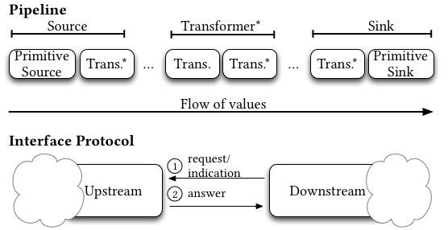

# Specification

This document aims to describe all possible interaction patterns between pull-stream modules (the pull-stream protocol). This may serve a module designer to ensure the module behaves correctly in all cases. In turn that will ensure users of pull-stream modules that any combination of them will work correctly in all cases.

This document is intentionally terse and aims for precision and clarity rather than accessibility. If you are looking for a general and quick introduction to pull-streams, look instead at [pull-streams by example](https://github.com/dominictarr/pull-stream-examples). If you want to learn how to design pull-stream modules, look at the [tutorials](https://github.com/pull-stream/pull-stream-workshop).

The presentation is separated in layers, following the [kernel language approach] (https://www.sics.se/~seif/Publications/fdp.pdf). This allows designers to quickly create modules that do not need the full capabilities of the protocol (however modules that are aimed for public usage should follow the full specification). This also eases reasoning about correctness by doing it in steps.

# Terminology

Different pull-stream documents may use different terms to describe the same things. We provide here a table of all terms used in this specification and to which other terms they correspond in other documents.

| Term                 | Definition                                                                                       | Synonyms                                     |
| :------------------- | :----------------------------------------------------------------------------------------------- | :------------------------------------------- |
| Answer               | Event from a module that happens after a request and goes to the module immediately downstream.  |                                              |
| Downstream           | The module(s) in a pipeline that come(s) next when following the flow of values.                 |                                              |
| Indication           | Event coming from a module to the module immediately upstream. It expects no answer.             | Read with no callback                        |
| Module               | Element of a pipeline, may be a source, sink or transformer.                                     |                                              |
| Pipeline             | Composition of a single source, zero or multiple transformers, and a single sink.                |                                              |
| Primitive Sink       | Elementary sink.                                                                                 |                                              |
| Primitive Source     | Elementary source.                                                                               |                                              |
| Request              | Event coming from a module to the module immediately upstream. It expects an answer.             | Read                                         |
| Sink                 | Module that consumes values, may be composed of a sink and transformer.                          | Consumer, Reader                             |
| Source               | Module that produces values, may be composed of a source and transformer.                        | Producer, Readable                           |
| Transformer          | Module that consumes and produces values, may be composed of multiple transformer.               | Through                                      |
| Upstream             | The module(s) in a pipeline that come(s) before when following the flow of values.               |                                              |

# Overview

# (1) Base Protocol

## Properties

## Interactions

# (2) Abortable Protocol: (1) + Early Aborting

## Properties

## Interactions

# (3) Fault-handling Protocol: (1) + (2) + Error Handling

## Properties

## Interactions

